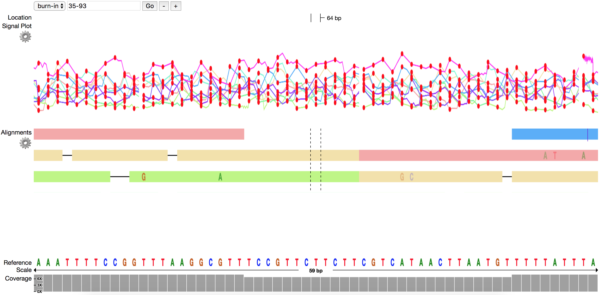

# nanoView
> Data Visualization tool for nanopore sequencing data.

[![NPM Version][npm-image]][npm-url]
[![Build Status][travis-image]][travis-url]
[![Downloads Stats][npm-downloads]][npm-url]

One to two paragraph statement about your product and what it does.




## Prerequisites

- NPM & NodeJS.
  - Standard NodeJS executable is named as nodejs, which needs to be
  linked to another file named node which is recognized by this program. It can be
  done using the command `ln -s /path/to/nodejs /path/to/node`.

## Installation

OS X & Linux:

```sh
$ git clone https://github.com/coadunate/nanoView.github
$ cd nanoView
$ npm Install
$ npm run build
```
## Deployment

Run the following command to serve the application on `http-server`

```sh
$ npm run http-server
```
Then open http://localhost:8080 in your browser of choice.

## Usage example

A few motivating and useful examples of how your product can be used. Spice this up with code blocks and potentially more screenshots.


## API

Write about the function of API in this program and how it can be used.

<!-- Markdown link & img dfn's -->
[npm-image]: https://img.shields.io/npm/v/datadog-metrics.svg?style=flat-square
[npm-url]: https://npmjs.org/package/datadog-metrics
[npm-downloads]: https://img.shields.io/npm/dm/datadog-metrics.svg?style=flat-square
[travis-image]: https://img.shields.io/travis/dbader/node-datadog-metrics/master.svg?style=flat-square
[travis-url]: https://travis-ci.org/dbader/node-datadog-metrics
[wiki]: https://github.com/yourname/yourproject/wiki
